[](http://www.gnu.org/licenses/gpl-3.0)

# YingHan

YingHan is an english input method with auto-suggestions and spell check features.

1. The auto-suggestion words are derived from Google's [1/3 million most frequent English words](http://norvig.com/ngrams/count_1w.txt). I have refined this list to 140,402 words, removing nearly all misspelled ones. Candidate words are sorted by frequency.
2. YingHan also functions as a Spell-Checker: when you input an incorrect word, it will suggest the right alternatives.
3. YingHan also serves as a Text Expander: You can define your favorite substitutions on YingHan's Preference UI(web page: http://127.0.0.1:62718), such as `{"te":"text expander", "yem":"you expand me"}`. 
4. Instant translation is available as you type words (currently, it only supports English-to-Chinese, but the translation dictionary can be configured later on).
5. Pinyin to English: you can input Hanyu Pinyin and receive the matching English word.
6. Fuzzy phonetic match is another feature. For example, you can input `cerrage` or `kerrage` to get `courage`, and `aosome` or `ausome` to get `awesome`.
7. You can switch to the default English input mode (the normal, quiet, or silent mode) by pressing the **right shift** key. Pressing shift again will switch back to the auto-suggestion mode.
8. **Next-Word Prediction**: Based on Google Books Ngram Corpus (2010-2019) English n-gram frequency data, the input method predicts the next word as you type. For example, after typing "i do not", it prioritizes suggestions like "know", "think", and "want". This feature is default off, need to turn on it in IME preference config.
9. **Pinyin to Chinese**: Press the right `Command` key to switch to Pinyin input mode. Type Chinese pinyin (or initial letters) and get Chinese hanzi candidates. For example, typing `niha` or the abbreviation `nh` will show "你好" and "你还". Press right `Command` again to switch back to intelligent English input mode.

# download and install

1. download releases

- for **macOS 10.12 ~ 14.2**: https://github.com/sylijinbo/YingHan/releases/latest, download the .pkg installer.
- for macOS 10.9 ~ 10.11(Deprecated version): https://github.com/sylijinbo/YingHan/releases/tag/v1.1.1, deprecated version, need to install the .app manually.
- Linux：https://github.com/fcitx-contrib/fcitx5-hallelujah, thanks [Qijia Liu](https://github.com/eagleoflqj)！

2. unzip the app, copy it to `/Library/Input\ Methods/` or `~/Library/Input\ Methods/`
3. go to `System Preferences` --> `Input Sources` --> click the + --> select English --> select YingHan
4. switch to YingHan input method

# update/reinstall

1. delete YingHan from `Input Sources`
2. kill the old YingHan process (kill it by `pkill -9 YingHan`, check it been killed via `ps ax|grep YingHan` )
3. replace the YingHan app in `/Library/Input Methods/`.
4. add YingHan to `Input Sources`
5. switch to YingHan, use it.

# Why it's named YingHan?

Inspired by [hallelujah_autocompletion](https://daringfireball.net/2006/10/hallelujah_autocompletion).

# preferences setting

click `Preferences...` or visit web ui: http://127.0.0.1:62718/index.html
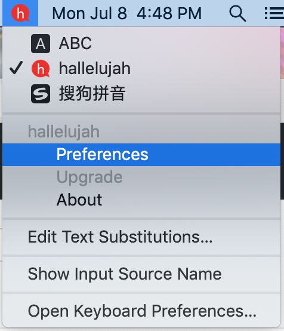

preferences config:<br/>


## Build project

1. `open YingHan.xcworkspace`
2. build the project.

## License

GPL3(GNU GENERAL PUBLIC LICENSE Version 3)

## Data Storage

This input method uses two SQLite databases, queried via FMDB (SQLite wrapper):

1. **English word database**: `~/Library/Application Support/YingHan/words_with_frequency_and_translation_and_ipa.sqlite3`
   - Contains ~140,402 English words with frequency, Chinese translation, and IPA
   - Contains ~9,955 English n-gram (2-5 word phrase) frequency entries for next-word prediction
   - Auto-copied from the app bundle during installation
   - Used for prefix matching candidate queries

   Schema:

   ```sql
   -- Words table: stores English words, frequency, Chinese translation, and IPA
   CREATE TABLE words (
       word TEXT PRIMARY KEY,
       frequency INT,
       translation TEXT,
       ipa TEXT
   );
   CREATE INDEX idx_word ON words(word);

   -- N-grams table: stores 2-5 word phrase frequencies for next-word prediction
   -- n: phrase length (2-5)
   -- context: all words except the last (e.g., "i do not")
   -- next_word: the last word, i.e., the predicted word (e.g., "know")
   -- frequency: occurrence count in the Google Books corpus
   CREATE TABLE ngrams (
       n INTEGER NOT NULL,
       context TEXT NOT NULL,
       next_word TEXT NOT NULL,
       frequency INTEGER NOT NULL,
       PRIMARY KEY (n, context, next_word)
   );
   CREATE INDEX idx_ngrams_context ON ngrams(n, context);
   ```

2. **Pinyin database**: `~/Library/Application Support/YingHan/pinyin_data.sqlite3`
   - Contains pinyin→hanzi mappings generated from the full [rime-ice](https://github.com/iDvel/rime-ice) Chinese dictionaries
   - Switch to pinyin mode via right Command key
   - Supports both full pinyin and initial-letter abbreviations
   - Results ranked by frequency
   - Auto-copied from the app bundle during install

   Schema:

   ```sql
   CREATE TABLE pinyin_data (
       id INTEGER PRIMARY KEY AUTOINCREMENT,
       hz TEXT NOT NULL,      -- Chinese hanzi
       py TEXT NOT NULL,      -- Full pinyin
       abbr TEXT NOT NULL,    -- Pinyin initial abbreviation
       freq REAL NOT NULL     -- Frequency score
   );
   CREATE INDEX idx_pinyin_freq ON pinyin_data(py, freq DESC);
   CREATE INDEX idx_abbr_freq ON pinyin_data(abbr, freq DESC);
   ```

3. **Substitutions database**: `~/Library/Application Support/YingHan/substitutions.sqlite3`
   - Stores user-defined Text-Expander substitution rules
   - Manage via the preference page at http://127.0.0.1:62718
   - Preserved across installs/updates (not overwritten)

   Schema:

   ```sql
   CREATE TABLE substitutions (
       key TEXT PRIMARY KEY,
       value TEXT
   );
   ```

### Thanks to the following projects:

1. [FMDB](https://github.com/ccgus/fmdb), SQLite wrapper for efficient prefix matching queries.
2. dictionary/cedict.json is transformed from [cc-cedict](https://cc-cedict.org/wiki/)
3. dictionary/pinyin_data.sqlite3 is generated from the full [rime-ice](https://github.com/iDvel/rime-ice) Chinese dictionaries, pinyin→hanzi mappings.
4. [cmudict](http://www.speech.cs.cmu.edu/cgi-bin/cmudict) and https://github.com/mphilli/English-to-IPA
4. [GCDWebServer](https://github.com/swisspol/GCDWebServer)
5. [talisman](https://github.com/Yomguithereal/talisman), using its phonex algorithm to implement fuzzy phonics match.
6. [MDCDamerauLevenshtein](https://github.com/modocache/MDCDamerauLevenshtein), using it to calculate the edit distance.
7. [Google Books Ngram Corpus](https://github.com/nicolas-ivanov/google-books-ngram-frequency), providing English n-gram (2-5 word phrase) frequency data for next-word prediction.
8. [squirrel](https://github.com/rime/squirrel), I shamelessly copied the script to install and build pkg App for Mac.

### snapshots

auto suggestion from local dictionary:<br/>
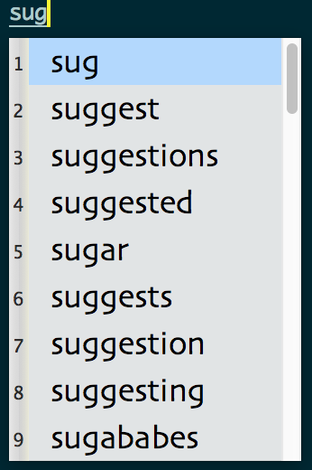
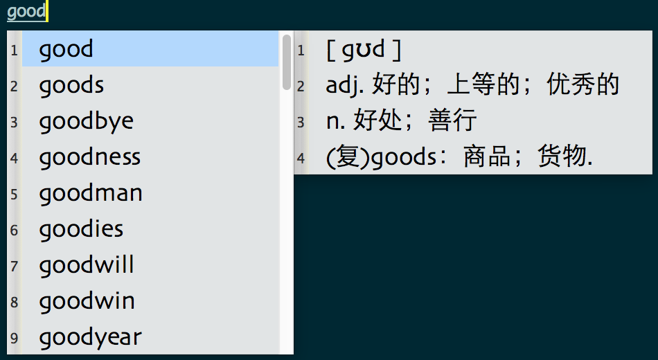
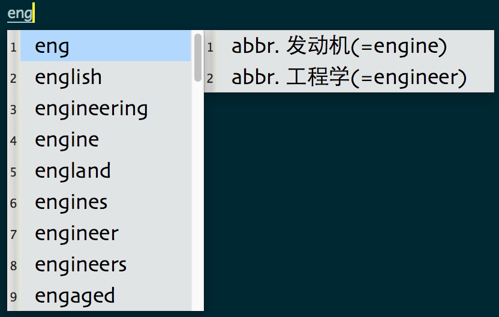

Text Expander: <br/>
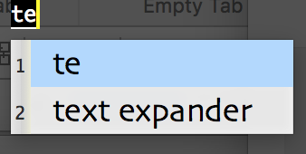
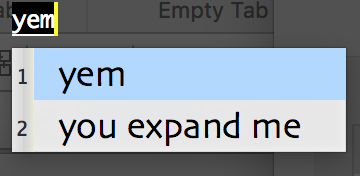

translation(inspired by [MacUIM](https://github.com/uim/uim/wiki/What%27s-uim%3F)):<br/>
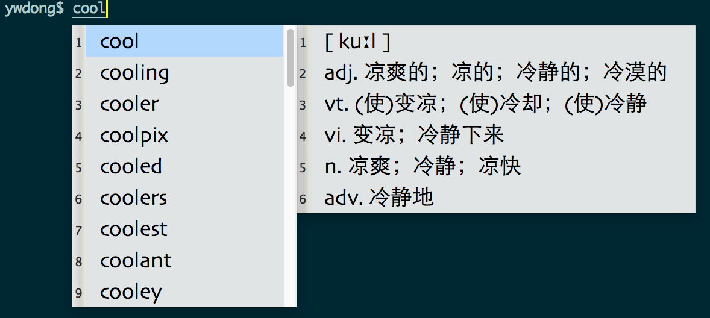

spell check:<br/>
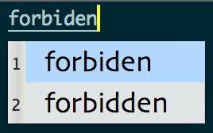
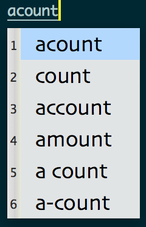
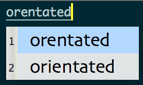
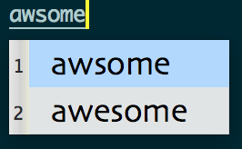
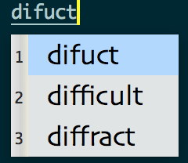

pinyin in, English out: <br/>
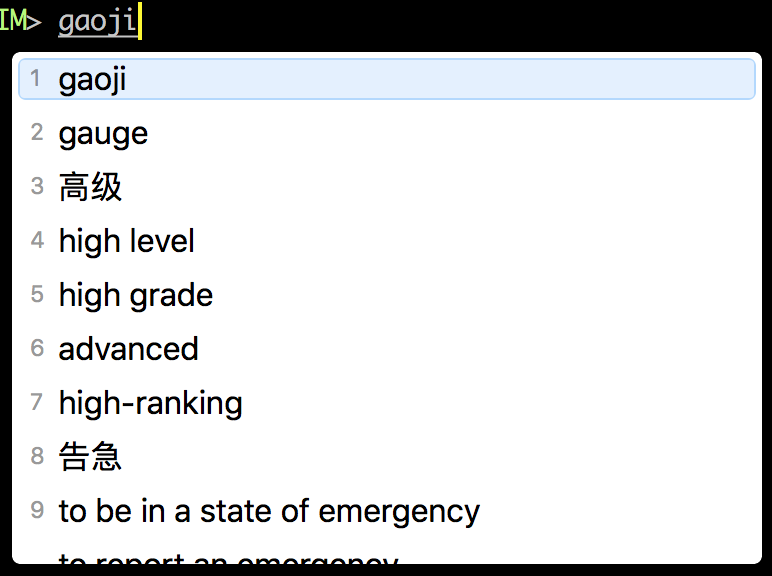
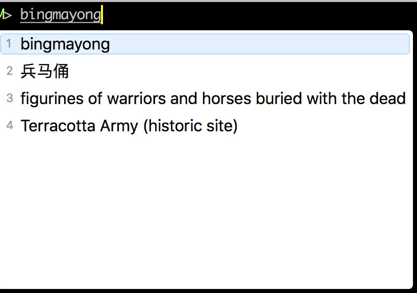
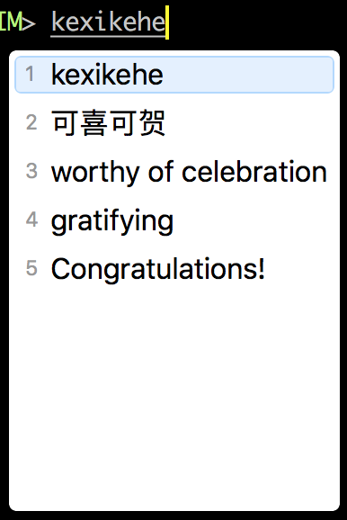
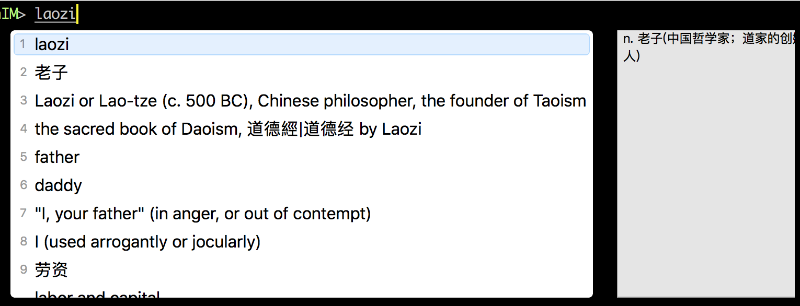
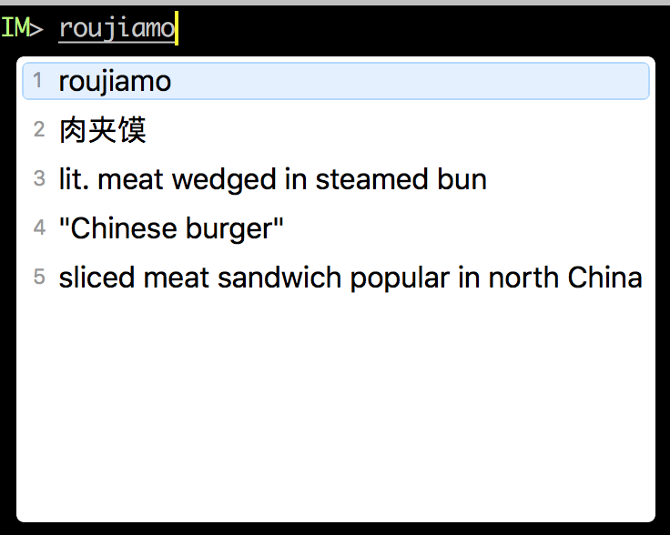
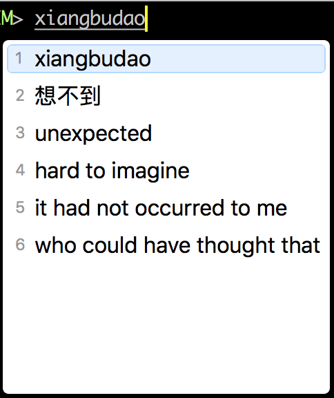
